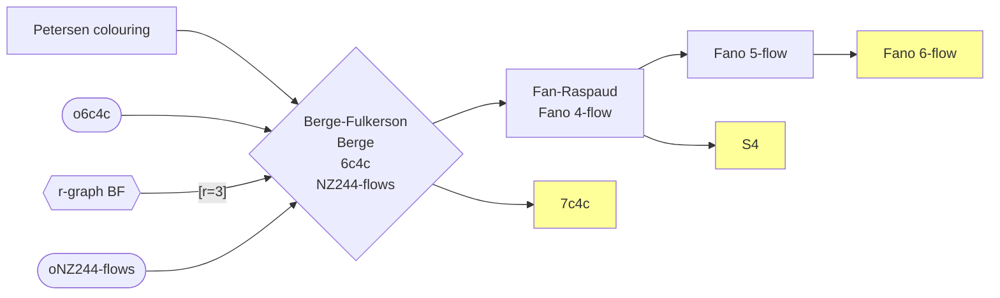

# Berge&ndash;Fulkerson conjecture and related conjectures

## Berge&ndash;Fulkerson conjecture

### Main conjecture

### Berge conjecture

### 6c4c (Cycle cover reformulation)

### NZ244-flows reformulation

## Fan&ndash;Raspaud conjecture

### Reformulations

- TODO: [15,17,20]
  - G. Mazzuoccolo, J.P. Zerafa, An equivalent formulation of the Fan–Raspaud Conjecture and related problems, Ars Math. Contemp. 18 (2020) 87–103
  - V.V. Mkrtchyan, G.N. Vardanyan, On two consequences of Berge-Fulkerson conjecture, AKCE Int. J. Graphs Comb. (2019), https://doi.org/10.1016/j.akcej.2019.03.018
  - J.P. Zerafa, On the consummate affairs of perfect matchings, PhD Thesis, Università degli Studi di Modena e Reggio Emilia, Italy, 2021, https://hdl.handle.net/11380/1237629

## Fano 5-flow conjecture

also known as $ \mathcal F_5 $-conjecture

## $S_4$-conjecture

<!-- ofdc[stronger oriented\nk-flow graph double cover] -> o244 -->